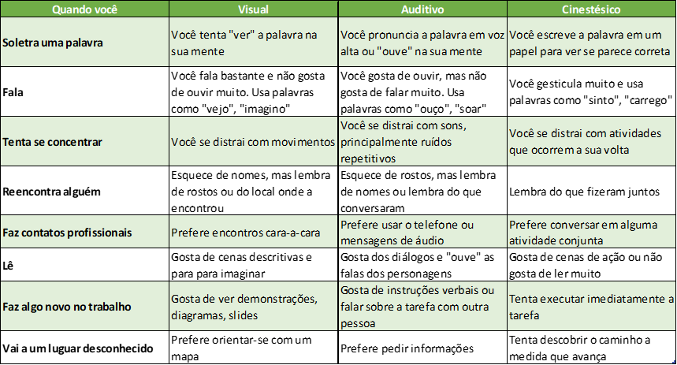

# Recursos

* Lista de [vídeos](https://www.youtube.com/playlist?list=PLwXQLZ3FdTVG_mqZcOXhfFf3Po6whFv8o) sobre lógica de programação.

* [Livro](https://www.amazon.com.br/C%C3%B3digo-limpo-Robert-C-Martin/dp/8576082675/ref=pd_sbs_14_4/146-6650619-7980322) Código Limpo: Habilidades Práticas do Agile Software

* [Livro](https://www.amazon.com.br/Extreme-Programming-Explained-Embrace-Change/dp/0201616416/ref=sr_1_6) Extreme Programming Explained: Embrace Change

* Inteligência emocional com Daniel Goleman: [vídeo](https://www.youtube.com/watch?v=BqF50IuR3_c)

* Prática de higiene emocional com Guy Winch: [vídeo](https://www.ted.com/talks/guy_winch_why_we_all_need_to_practice_emotional_first_aid?language=pt-br)

* Transição do mercado tradicional para o digital: [vídeo](https://www.youtube.com/watch?v=fPPvBXlut90&feature=youtu.be)

* Teste sobre estilos de aprendizado: [link](https://www.buzzfeed.com/gamaacademy/estilo-de-aprendizado-bq59r4ckhq)

* Plano de carreira e expectativas com o CEO da Gama Academy: [vídeo](https://www.youtube.com/watch?v=gcFjIi_LO7A&feature=youtu.be)

* A escritora e artista Emilie Wapnick descreve o tipo de pessoa que ela chama de "multipotencial", aquela que tem uma gama de empregos e variados interesses durante a vida: [vídeo](https://www.ted.com/talks/emilie_wapnick_why_some_of_us_don_t_have_one_true_calling?language=pt-br)

* Tipos de profissionais: [artigo](https://www.forbes.com/sites/andyboynton/2011/10/18/are-you-an-i-or-a-t/?sh=17e8b8186e88)

* Carol Dweck, professora e pesquisadora discorre sobre o termo "mentalidade de crescimento" em seu livro Mindset: A nova psicologia do sucesso: [vídeo](https://www.youtube.com/watch?v=1hPuRBhYoo8)

* Crescer no desconforto: [artigo](https://www.linkedin.com/pulse/ostra-feliz-não-faz-pérola-victor-feitosa/)

* Lean Startup com Eric Ries: [vídeo](
https://www.youtube.com/watch?v=fEvKo90qBns&feature=youtu.be&t=2m27s)

* A razão do sucesso das startups com Bill Gross: [vídeo](https://www.ted.com/talks/bill_gross_the_single_biggest_reason_why_start_ups_succeed?language=pt)

* Gestão de projetos ágeis: [artigo](https://exame.com/revista-exame/grandes-empresas-querem-se-parecer-mais-com-startups/)

* Scrum: [vídeo](https://www.youtube.com/watch?v=XfvQWnRgxG0)

* [Artigo](http://rogeriocher.com.br/2017/10/28/coragem-e-vulnerabilidade/) sobre trabalho em equipe.

* [Artigo](https://www.linkedin.com/pulse/qual-diferen%C3%A7a-entre-diversidade-e-inclus%C3%A3o-ricardo-sales/) sobre diversidade e inclusão.

* Neste [vídeo](https://www.ted.com/talks/rocio_lorenzo_want_a_more_innovative_company_hire_more_women/transcript?language=pt-br) Rocío Lorenzo fala sobre como as empresas podem ser mais inovadoras.

* Lean Mindset e o time de produto: [artigo](https://qulture.rocks/blog/como-a-spotify-organiza-seus-times-de-produto/).